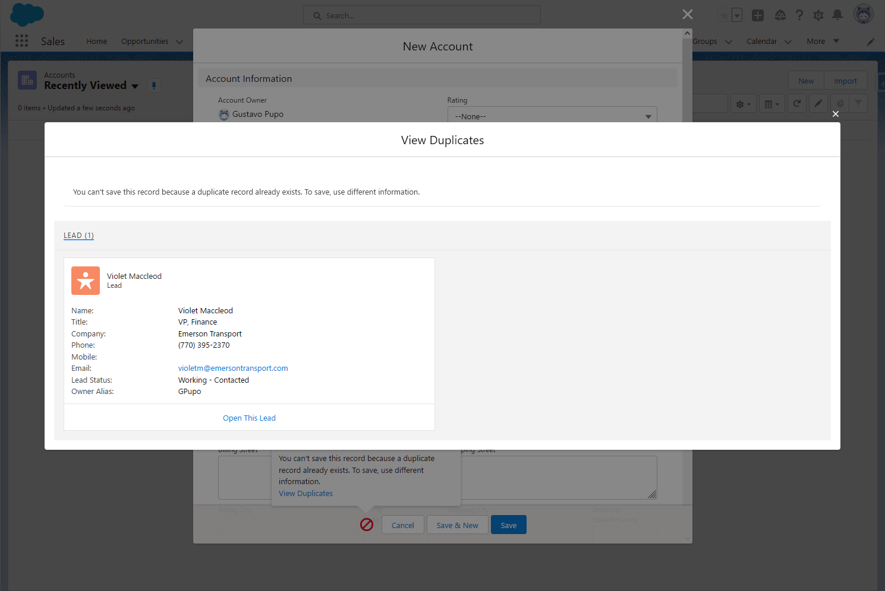

# Otter Development Challenge

Solution for the Salesforce Developer Take Home exercise.

Developed by Gustavo Pupo (hello@gustavopupo.com).

## Description

Meeting every item listed in the exercise description was the main goal of this solution. The starting point was building the project structure around the Apex Enterprise Pattern standards. The next step was designing the Request and Response objects used by the `@RestResource` endpoint, and also designing the endpoint itself. The Services, Selectors, the Queueable async job, and other classes were developed afterward.

The overall code coverage of the tests is 92% for the whole org (includes FFLib tests), with most of the classes developed for the solution achieving 100% coverage.


A description of the main Apex classes is provided below.

### SelfSignUpResource

This class implements the `@RestResource` endpoint for the self sign-up funnel and it is responsible for deserializing the Request object, calling the `SelfSignUpService` class for processing the request, and finally serializing the Response object that gets returned.

This endpoint expects a payload in the following format:

```
{
    "companyName": "ACME",
    "email": "example@example.com",
    "phone": "+1 (123) 456-7890",
    "selectedProducts": [
        {
            "uuid": "d7836b3f-2880-47b3-af05-23917941d32c",
            "quantity": 1
        }
    ],
    "address": {
        "city": "New York",
        "country": "United States",
        "postalCode": "10001",
        "state": "NY",
        "street": "1000 Example Street"
    },
    "firstName": "John",
    "lastName": "Doe"
}
```

This endpoint sends appropriate HTTP status codes depending on the outcome of the request. The table below lists the HTTP status codes that may be returned.

|HTTP Status Code|Domain Status Code|Description|
|---|---|---|
|200 OK|MATCHING_ACCOUNT_ALREADY_EXISTS|Returned if an Account that matches the Company Name from the request is found.|
|201 Created|NO_MATCHING_ACCOUNT_OR_LEAD_FOUND|Returned if new Account, Opportunity, and Contact records were created after no matching Account or Lead records were found.|
|202 Accepted|EXISTING_LEAD_QUEUED_FOR_CONVERSION|An existing Lead that matches the Company Name was found and was queued for conversion.|
|400 Bad Request|MISSING_REQUIRED_FIELDS|Validation error returned when the request does not contain one or more required fields (Company Name, First Name, and Last Name).|
|400 Bad Request|SELECTED_PRODUCT_UUID_NOT_FOUND|Validation error returned when the request does not contain any selected products or if one or more UUIDs that were provided do not match any existing Product records in Salesforce.|

### SelfSignUpService

In this class, the `processSelfSignUp` method implements the business rules of the self sign-up funnel. This method first validates the Request object to make sure that the required fields (Company Name, First Name, and Last Name) are present and also checks if the UUIDs provided in the Request can be matched to existing Product records in the Salesforce database.

After validating the Request object, the service method tries to locate an Account that matches the Company Name from the Request. If an Account is found, no action is taken.

Otherwise, it looks for a Lead that matches the Company Name. If a Lead is found, it is converted using an asynchronous job.

If no Account or Lead records are found, new Account, Opportunity, and Contact records are created.

Finally, the Opportunity record is marked as Closed Won and the selected products are added to the Opportunity.

### Duplicate checks

One of the requirements was that users should not be able to create duplicates via the UI. This requirement was implemented by making use of the standard Duplicate Rules feature in the Setup. Therefore, no code was used.

#### Checking for an existing Account when inserting a Lead


#### Checking for an existing Lead when inserting a Account


